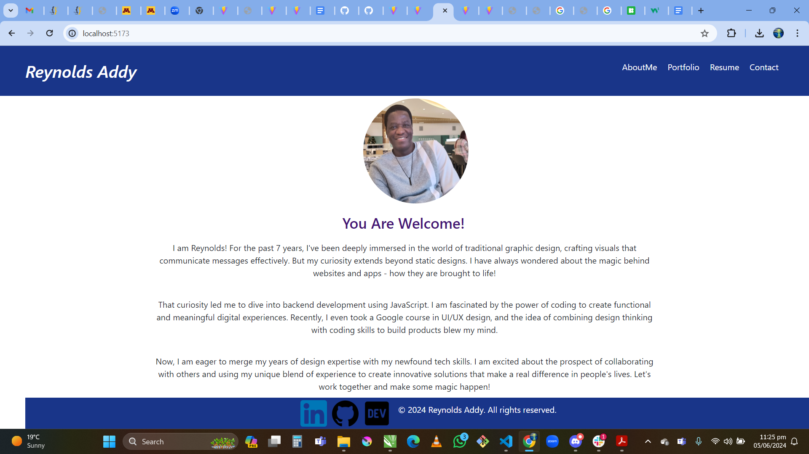
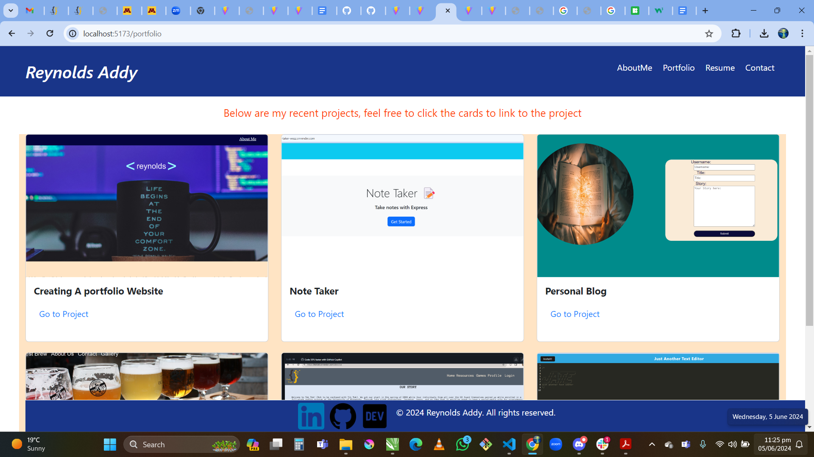
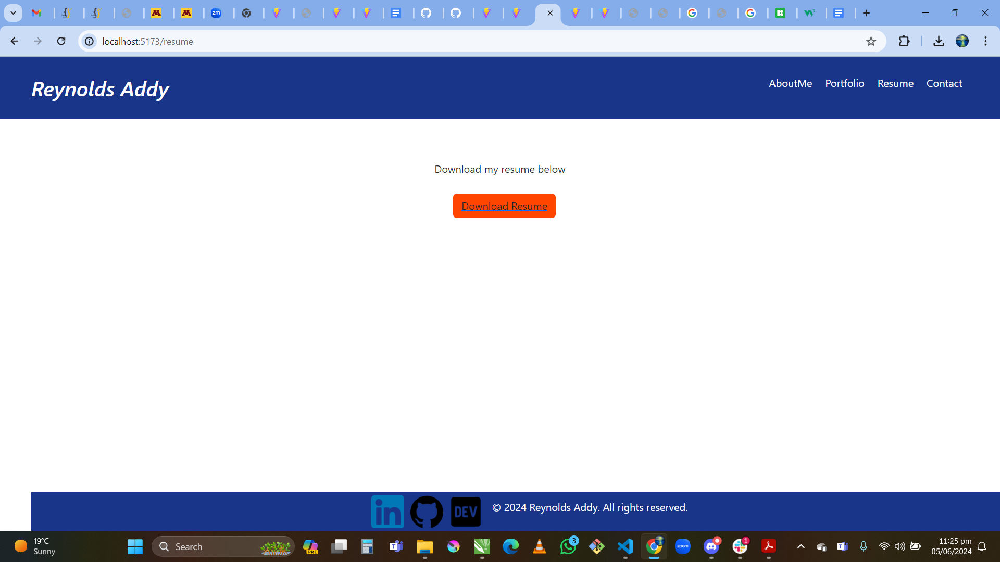
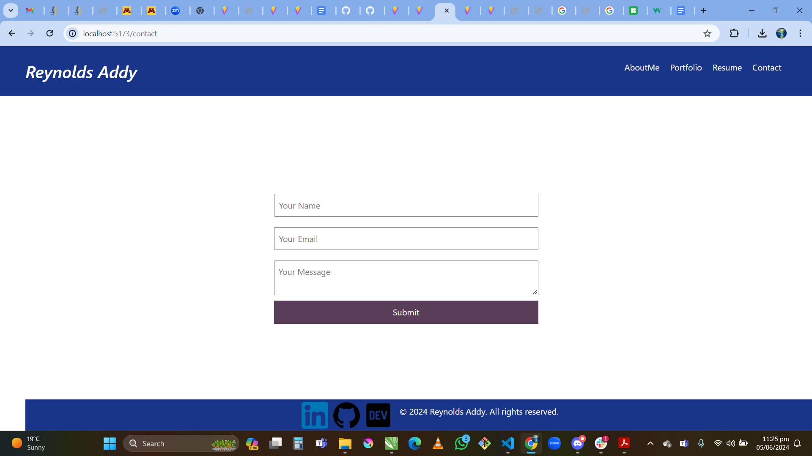

# Title:
 Portfolio Using React

## Note:
All code is in the Portfolio folder. Used React!

## Description

GIVEN a single-page application portfolio for a web developer
WHEN you load the portfolio
THEN you am presented with a page containing a header, a section for content, and a footer
WHEN you view the header
THEN you am presented with the developer's name and navigation with titles corresponding to different sections of the portfolio
WHEN you view the navigation titles
THEN yo am presented with the titles About Me, Portfolio, Contact, and Resume, and the title corresponding to the current section is highlighted
WHEN you click on a navigation title
THEN you am presented with the corresponding section below the navigation without the page reloading and that title is highlighted
WHEN you load the portfolio the first time
THEN the About Me title and section are selected by default
WHEN you am presented with the About Me section
THEN you see a recent photo or avatar of the developer and a short bio about them
WHEN you am presented with the Portfolio section
THEN you see titled images of six of the developer’s applications with links to both the deployed applications and the corresponding GitHub repository
WHEN you am presented with the Contact section
THEN you see a contact form with fields for a name, an email address, and a message
WHEN you move my cursor out of one of the form fields without entering text
THEN you receive a notification that this field is required
WHEN you enter text into the email address field
THEN you receive a notification if I have entered an invalid email address
WHEN you am presented with the Resume section
THEN you see a link to a downloadable resume and a list of the developer’s proficiencies
WHEN you view the footer
THEN you am presented with text or icon links to the developer’s GitHub and LinkedIn profiles, and their profile on a third platform (Stack Overflow, Twitter)

deploy url: https://rey2.netlify.app/

github URL: https://github.com/Reynoldscode/Portfolio-React

